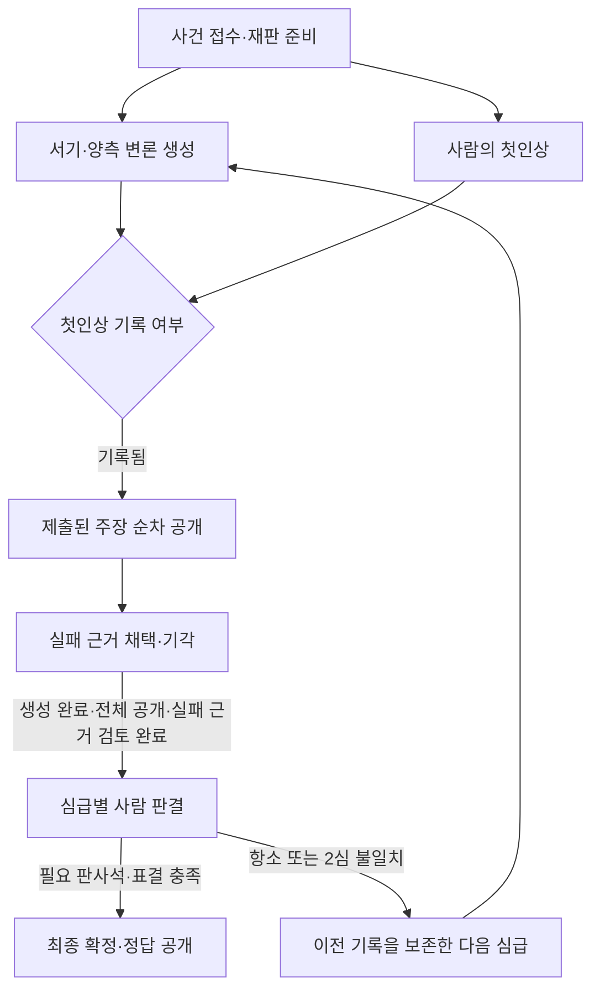
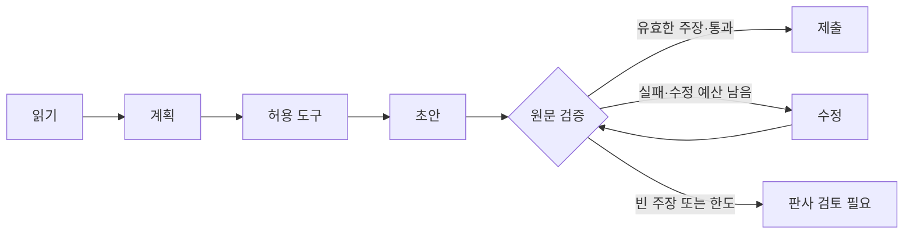

# 실행 그래프로 제어하는 AI 법정

작성: 2026-10-02 · 구현 기준 v1 · 로컬 단일 프로세스 MVP

## 제품 방향

기사에 대한 양측 AI의 주장과 코드 검증을 정해진 절차로 진행하고, 사람이 근거와 판결을 결정하는 법정이다. 사용자는 현재 작업, 이동 조건, 실패 이유와 자신의 다음 행동을 확인한다.

히구루마의 주복사사에서 가져오는 원리는 절차·권한·증거·재심의 규칙이다. 원작의 저지맨을 **코드의 절차 검증**과 **사람의 판결**로 나눈다. 정보 비대칭, 전지적 판결, 몰수·사형은 도입하지 않는다. 검증에 실패한 인용은 기사 유죄의 증거가 아니다.

## 확인한 현재 구조

| 확인된 사실 | 변화 |
|---|---|
| `Session`과 `_loop`가 계획·도구·초안·검증·최대 2회 수정을 수행, 단계당 모델 호출 총 4회 제한 | 같은 작업을 명시적 노드/허용 전이로 제어 |
| `instances.run`이 심급별 에이전트를 순차 호출 | 로컬 모델 단일 호출 유지, 양측 입력·역할은 독립 |
| 작업 큐·events·partial은 메모리, 재판 JSON만 완료 시 저장 | 실행 스냅샷과 모델 응답 체크포인트 저장, 중단·재개·취소 |
| 첫인상 가림은 주로 프론트, API는 원본 주장·권고 반환 | API·장부·작업·집계의 공통 공개 정책 |
| 장부 API는 형식만 검사, final 직접 제출 가능 | 현재 기록 기반 전이와 판사석/표결 검증 |
| 원문 인용 검증과 온톨로지·천칭 규칙 존재 | 그대로 재사용, 원문 일치와 주장 타당성 분리 |
| 문서 상단의 1심 사전 생성 설명과 최신 실시간 생성 코드가 다름 | 실시간 생성 + 기존 기록 재생으로 명세 통일 |

## 실행 그래프와 근거 그래프

실행 그래프는 어떤 작업을 언제 실행할지 결정한다. 근거 온톨로지는 주장/근거의 유형과 의미를 정의하고, 근거 그래프는 주장·인용·반박의 관계를 보여준다. 실행 화면에 이 둘을 섞지 않는다.

## 노드와 권한

| 노드 | 담당 | 입력 → 출력 | 허용 전이·기록 |
|---|---|---|---|
| read | 코드 | 공개 기사 → 문장·허용 핵심어 | plan, 중성 단계 |
| plan | LLM | 공개 기사·역할 → 유효 문장/주장 유형 | tool, 스키마로 제한 |
| tool | 코드 | 검증된 계획 → 원문 읽기·본문 검색 | draft, 허용 함수만 실행 |
| draft | LLM | 원문·역할 → 구조화 주장 | check, 호출 예산 차감 |
| check | 코드 | 주장 → 인용/부재 검증 결과 | submit/revise/escalate, 분기 사유 |
| revise | LLM | 오류와 원문 → 수정안 | check, 최대 2회·총 4회 모델 호출 |
| submit/escalate | 코드 | 검증 결과 → 제출/검토 필요 기록 | 종료, 주장 식별자와 근거 보존 |
| first_impression | 사람 | 기사 → 방향·확신도 | 공개 게이트 해제, 중복·사후 수정 금지 |
| reveal/review | 사람·자동 공개 요청 | 실제 claim/evidence ID → 공개·판정 | 서버가 ID와 공개 순서 검증 |
| seat_verdict | 사람 | 공개·검토 완료 자료 → 판사석 판결 | 심급별 1/2/3석, 사유 10자 이상 |
| final/appeal | 사람 | 저장된 표결 → 확정/다음 심급 | 표결 일치·다수결·사유·심급 검증 |

코드 검증을 통과하지 못한 근거는 사람이 명시적으로 채택/기각해야 판결로 진행한다. 정상 근거에도 기존의 채택/기각을 사용할 수 있다. 최초 공개 전에는 AI 방향·원문 검색 결과·실패 건수·천칭을 반환하지 않는다. 실패 근거를 채택해도 원래 검증 결과는 바꾸지 않는다.

## 저장·재개

실행별 JSON을 기존 원자적 교체 방식으로 저장한다. 동일 프로세스의 공유 잠금 아래 상태·이벤트·완료 결과·모델 응답 체크포인트를 갱신한다. 새 패키지는 추가하지 않는다. 서버는 단일 worker 프로세스로 실행한다.

- 실행에는 고정 ID, 그래프 버전, attempt, 공개 기사/정책/이전 재판 스냅샷, 이벤트, 중간 결과, 모델 호출 체크포인트를 보관한다.
- enqueue 시점 접수 결과의 부재도 고정 입력이다. 실행 도중 다른 접수 결과 파일이 생겨도 끌어오지 않는다. 역할 프롬프트·온톨로지 해시와 모델 설정이 바뀌면 이전 실행 재개를 차단한다.
- 시작할 때 미완료 실행은 interrupted로 표시하며 자동으로 모델을 재호출하지 않는다.
- 사용자가 재개하면 기존 ID에서 새 attempt를 만든다. 완료된 동일 입력 모델 호출은 저장된 응답을 재사용하고 도메인의 순수 계산을 재실행한다. 이것은 임의 명령/외부 부작용을 재생하는 기능이 아니다.
- 완료 기록과 실행 상태의 쓰기 사이에 중단될 수 있으므로 run ID가 같은 완료 기록을 우선하여 상태를 조정한다.
- 취소는 즉시 논리 상태를 바꾸고 이후 이벤트/모델 응답/재판 저장을 attempt와 상태로 차단한다. 이미 전송한 Ollama 계산을 물리적으로 중단한다고 주장하지 않는다.
- 최대 실행 attempt 3회. 각 에이전트 작업의 모델 호출 최대 4회, 수정 최대 2회. 호출별 120초·응답 출력 한도 2048 토큰·실행당 30분 상한을 적용한다. 로컬 실행 비용은 호출·토큰·시간으로 기록한다.
- 법정 입력은 read→validate→append를 같은 잠금에서 수행한다. 요청 ID가 같으면 같은 응답, 다른 본문이면 409. 이미 완료된 판결/공개 요청의 반복도 의미상 중복 처리한다.

## 기술 선택

| 방식 | 장점 | 비용 | 선택 |
|---|---|---|---|
| 기존 Python + 작은 전이표 + 실행 스냅샷 | 현재 루프·콜백·JSON 재사용, 의존성 없음, 검증 경계 명확 | 복구·멱등성 직접 구현, 단일 프로세스 전제 | 이번 MVP |
| 별도 그래프 프레임워크 | 더 큰 워크플로의 체크포인트·인터럽트 확장 가능 | 버전/저장 어댑터 조사, 현재 구조 마이그레이션 | 다중 worker 요구가 생기면 공식 문서 기반 재평가 |

## 공개 정책과 로컬 범위

일반 법정은 같은 컴퓨터에서 공유하는 사건별 첫인상 게이트다. 인증된 사용자별 비밀 유지나 독립 판사 보장은 제공하지 않는다. 실험실 조회에는 labSessionId를 명시하고 사건 소속을 검증한다. A는 기사만, B는 서기 권고, C는 변론을 제공한다. 실험실 판결은 일반 법정 게이트를 열지 않는다. 정답 기반 통계는 최종 확정 사건만 대상으로 한다.

실험실은 기존 비교 실험을 위해 첫인상 없는 별도 판결 절차를 유지한다. C의 AI 권고는 판결 입력 영역에서 보이며, 응답 자체를 판결 직전까지 지연하는 서버 게이트는 없다. 이를 일반 법정의 공개 조건과 혼동하지 않는다.

## 화면

- 법정: 사건 단계 + 에이전트 실행 노드, 실제 생성/기록 재생/모의 시연 표시, 실패 사유, 재개·취소, 다음 사람 행동.
- 작업실: 현재 노드·대기 이유. 최초 공개 전에는 중성 문구만.
- 감사 장부: 실행 ID·버전·시도·실제 이벤트 경로. 옛 기록은 ‘실행 그래프 기록 없음’으로 구분.
- 규칙: 절차·공개 조건·수정 한도·사람 판결을 설명하고 실행/근거 그래프를 구별.
- 대시보드: 실행/대기/중단 상태. 표본이 없는 정확도는 빈 상태로 표시.

새로운 캐릭터 복제나 자동 처벌 연출을 추가하지 않는다. 기존 신문 피고·2D 법정·구현 현황 메뉴를 유지한다.

## 검증과 단계

먼저 공개·판결 우회 및 실행 복구 회귀 테스트를 실패시킨 뒤 구현한다. 정상 완료, 인용 수정, 빈 주장, 수정 한도, 취소 후 지연 결과, 재시작·재개, 중복 요청, 잘못된 표결, 실험실 경계, 정답 집계, 명령문이 포함된 기사에 대한 도구 허용목록을 검사한다. 기존 전체 테스트·타입·빌드·하네스 검사와 브라우저 흐름을 확인한다. 실제 모델/AI-Hub가 없는 경우 합성 테스트와 모의 시연을 구별해 보고한다.

이번 MVP는 로컬 프로토타입에 한정한다. 다중 사용자 인증, 분산 worker, 외부 언론사 통보·노출 하향 실제 실행, 임의 노드 편집기는 후속 범위다.
